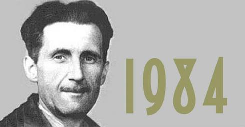

I created my [LinkedIn](https://www.linkedin.com/) account in 2007, and I closed it down on January 7th, 2023 because it was time to say goodbye. Here's why:

Censorship

Like almost every other US-based media platform, LinkedIn suppressed anything that challenged or conflicted with the Government Approved Official COVID Narrative (references [here](https://brownstone.org/?s=linkedin)). I try not to support, promote or spend money on organizations that refuse to defend the right to free speech when the going gets rough.

Hey, I'm Retired!

LinkedIn originally was set up as a kind of Professional Facebook, but it eventually devolved into just another job board with elaborate self-promotion tools. While I might consider part time work in a consultancy position for a start-up, this is not the kind of gig that LinkedIn is set up to promote. If you are periodically updating your account with articles, accomplishments, job changes and other good stuff like that, LinkedIn is probably still a decent career tool. Being retired, I would only log into my account every few months just to clear all of the messages and other nagware. Pretty pointless...

It's Another Potential Government Surveillance Tool

If local law enforcement or the Military-Industrial-Intelligence-Medical complex wants to find out about you, what's their first step? Hop on the Internet and checkout Facebook, Twitter, Google and LinkedIn. Why make it easy for the American [Stasi](https://en.wikipedia.org/wiki/Stasi) - harder targets may get bypassed in search of easier prey.

You Probably Don't Want to Hire Me Anyway

To paraphrase [Groucho Marx](https://en.wikiquote.org/wiki/Groucho_Marx), I would not want to work for a company that would hire me from LinkedIn. Corporate America has succumbed to [Wokeism](https://www.urbandictionary.com/define.php?term=Wokeism), [DEI](https://en.wikipedia.org/wiki/Diversity,_equity,_and_inclusion) and LBGTQIWTF activism, and as a result I am no longer a good fit as an employee. I would have a hard time maintaining a professional attitude with colleagues that sport purple hair, metal piercings and neck tattoos, and I absolutely would not be able to work with - or for - males that wear lipstick. Hey, call me a dinosaur, but this kind of stuff belongs in a circus freak show, not the American workplace.

So - I'll maintain my professional credentials on my web site and on this blog, and interested parties can reach out to me via email - or not. Cheers!
